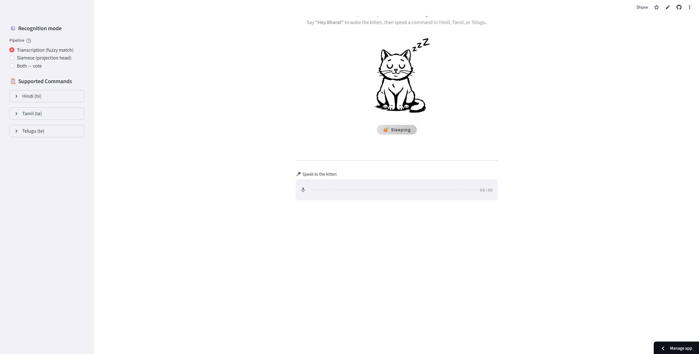
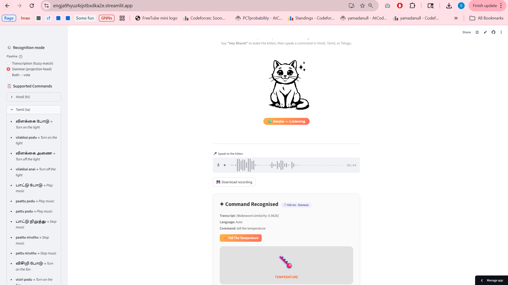

# SMAI Assignment 3 Submission

## Topic

**T11.7 — Wakeword + multi-language commands**

## Project

**Indic Speech Command Recognizer**  
Whisper-tiny + acoustic wakeword + Hindi/Tamil/Telugu smart-home commands

**GitHub repository:** https://github.com/saiaditya14/smai-a3  
**Deployed working prototype:** https://engja9hyuz4sjstbxdka2e.streamlit.app/

## Team

| Name | Roll number | Email |
|---|---|---|
| Aryan Maskara | 2023111004 | aryan.maskara@research.iiit.ac.in |
| Sai Ramanathan | 2023101096 | sai.ramanathan@students.iiit.ac.in |
| Neha Murthy | 2023115018 | neha.murthy@research.iiit.ac.in |
| Yajat Lakhanpal | 2023111015 | yajat.lakhanpal@research.iiit.ac.in |
| Prasoon Dev | 2023111014 | prasoon.dev@research.iiit.ac.in |
| Aanchal Mundhada | 2023112016 | aanchal.mundhada@research.iiit.ac.in |

## Prototype Screenshots

## Executive Summary

We built a multilingual voice-command frontend that listens for the English
wakeword "Hey Bharat" and then accepts smart-home commands in Hindi, Tamil, or
Telugu. The system runs on Whisper-tiny on CPU and compares two recognition
heads:

**Path A: transcription + fuzzy matching.** Whisper is forced to transcribe in
Hindi, Tamil, and Telugu, then the transcript is matched against a curated
command dictionary using exact substring and sliding-window fuzzy matching.

**Path B: siamese projection head.** Whisper's encoder embedding is projected
through a contrastive MLP and classified by nearest command prototype. This
path avoids autoregressive decoding and is substantially faster.

Headline results:

| Metric | Result |
|---|---|
| Path A skip-wake intent accuracy | 70.47% |
| Path B headline accuracy | 93.22% |
| Path B 5-fold CV | 91.24% ± 6.25% |
| Path A latency | ~1623 ms / clip |
| Path B latency | ~270 ms / clip |
| Path B command FPR on unseen hard negatives | 0.0% |

The submitted recommendation is Path B as the default because T11.7 uses a
fixed Indic command setting, and Path B is faster, more accurate on the target
languages, and stronger on hard-negative rejection. Path A remains exposed as
an interpretable fallback/debug mode because it can catch wakeword-only cases
without inventing a command and can be extended to new command strings without
retraining.

## Limitations and Future Work

The deployed prototype uses a fixed wakeword cosine threshold tuned on the
team's microphones. A threshold slightly below 0.910 would likely improve
recall for weaker browser/laptop microphones, and a larger calibration set
across phones, headsets, and laptops would make the wakeword detector more
robust. The current wakeword gate is intentionally permissive; command-level
filtering, especially Path A's fuzzy command matcher and Path B's reject
prototype, suppresses most command false positives.

Another future improvement is an explicit wakeword-only detector: a tiny
neural classifier or reject prototype could decide whether speech after "Hey
Bharat" contains an actual command before either recognition head fires.

The siamese head performs strongly when all target languages are represented
in training, but its cross-language hold-out accuracy is weak. Future work
should collect more languages and speakers, tune wakeword thresholds by device
class, and optionally fine-tune Whisper with LoRA in a separate training cycle
rather than only training a projection head.

## Full Report

See `REPORT.md` for the detailed methodology, ablations, benchmark results,
architecture comparison, and references.
